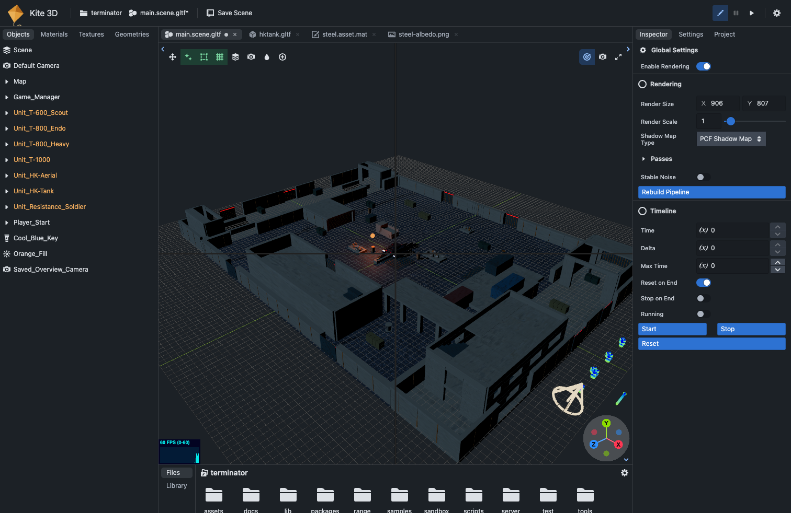
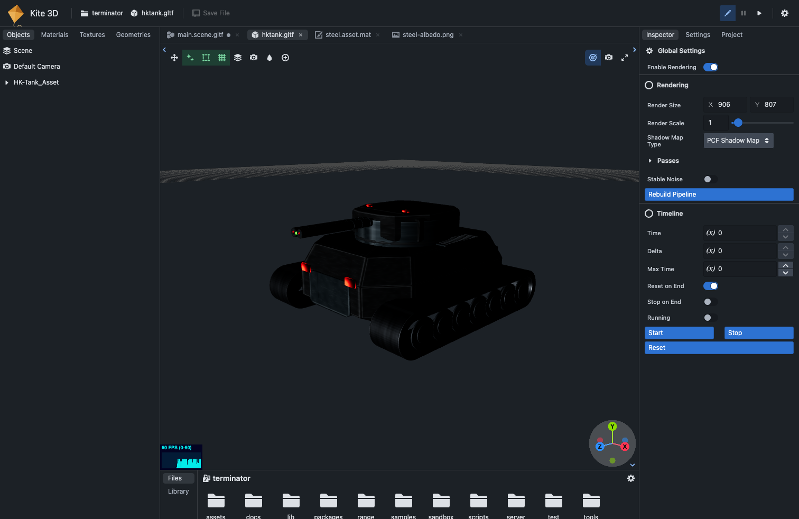
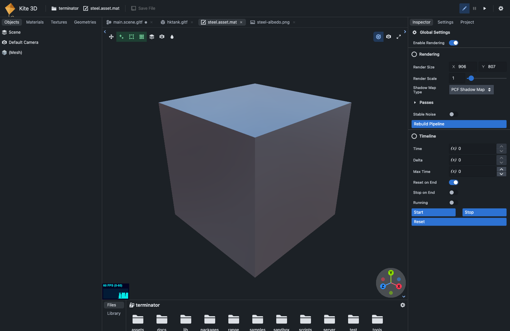
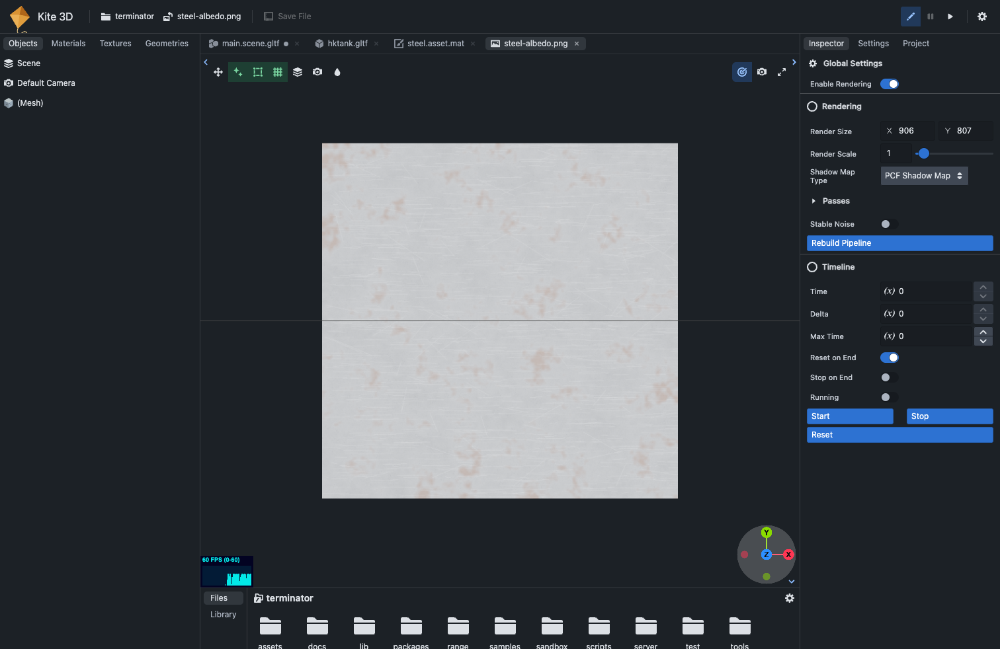

# One viewport, many documents, revision 3

A design note for the Kite3D editor. Revision 3, 2026-09-16, against `main` at c7c53335 (0.20.1). Every path below points into `/Users/minjunes/kite3d`; line numbers are from that commit. Revision 2 (2026-09-14) was written against the old editor, before the restart from upstream; this revision re-reads every line it cited and keeps only what still holds.

Revision 1 chose one WebGL viewer per tab and was rejected for the duplicated GPU memory. Revision 2 kept one viewer and made every open document resident, with the viewer swapping what it shows. Revision 3 keeps that design and renames the one viewer's wrapper from Stage to Viewport, the word Godot, Unreal and Blender use for it. What changed is the ground under it, and it changed in both directions: two of the note's work items shipped on their own in the rewrite, and one of its premises got harder.

## TL;DR

- A document is any file the editor opens on the viewport. Today that is four kinds: a scene, an object asset, a material, and a texture. Text files are not documents in this revision, because the editor has no text view any more and agents edit scripts; that is decision 3 below.
- There is one 3D viewer, the viewport. Every open document keeps its object tree in memory; only the active one sits under `modelRoot`. Switching detaches one, attaches the other, and restores that document's camera, selection, settings and undo ledger.
- No GPU redundancy. threepipe's object manager unregisters a detached tree and disposes the GPU side of its exclusive materials, textures and geometries; three re-uploads them on the next draw. Nothing in that machinery changed in the rewrite.
- The harder premise: today a switch does not detach, it disposes. `loadProjectFile` calls `unloadScene()`, which runs `disposeSceneModels(true, true)` and `disposeTextures(true)`. Residency starts by replacing that dispose with a detach.
- Already shipped since revision 2: the material preview rig (a box, two lights, an HDR environment), a texture preview, and the asset hot reload, so a save in Blender already reaches every placed instance. The Blender launch itself is not built now, by decision.
- Views as render targets (a live material sphere, thumbnails, a split view) stay "later", on the same renderer.

## 1. What changed since revision 2

Let me be exact about the ground, because the plan's cost depends on it.

- The editor is upstream's again, restarted from repalash/threepipe-blueprint-editor and rewritten per `docs/editor-rewrite-plan.md`. The manager still fuses one document and one view: `_viewers = new Map<string, ThreeViewer>()` at `packages/editor/src/utils/ViewerInstanceManager.ts:120`, `get(props?, id = 'default', container?)` at `:142`, no caller passing a second id, and upstream's own guard against recreating the viewer at `:218-220`. Revision 2's "one slot" observation holds.
- The per-document state is the same handful of loose fields, reset together by `_unloadProjectFile` (`:1614-1628`): `loadedScene` (`:1163`), `loadedSceneName` (`:1164`), `loadedPath` (`:1166`), `loadedAssetObj` (`:1167`, now `IObject3D | IMaterial | ITexture | null`), `_loadedProjectFile` (`:1169`), `_loadedNeedsSave` (`:1178`), `savedSceneHash` (`:454`), and Play's `_runningSceneFile` (`:1397`).
- Opening a file disposes the current content. `loadProjectFile` (`:1404`) returns early for the same file (`:1419-1423`), refuses a dirty document unless forced (`:1424`), then `_unloadProjectFile()` (`:1425`) runs `unloadScene()` (`:1600-1611`): `disposeSceneModels(true, true)`, `disposeTextures(true)`, and the camera's components stripped. Revision 2 said "evicts"; the truth is "destroys".
- The material preview rig exists: an opened `.mat` gets a `BoxGeometry` mesh with the material, a hemisphere light, a directional light and an HDR environment (`:1532-1541`). A texture gets a plane with an unlit material (`:1549-1556`). Saving a texture is refused ("Texture Save not implemented yet.", `:1741-1744`). The navbar Save button reaches an opened asset (`SaveProjectButton.tsx:76-83`), while the Inspector's own Save Asset stays gated by `assetRootPathCanEdit` (`InspectorPanelComponent.tsx:162`).
- The asset hot reload shipped. A changed asset file reaches every placed instance through `scheduleAssetRefresh` (`:513`), `assetOwning` (`:535`) and `refreshAsset` (`:524`), which calls upstream's `AssetTracker.refreshFromRegistry` (`packages/editor/src/utils/AssetTracker.ts:304`), with one 250 ms timer per asset.
- Text has no code left. CodeMirror, `sourceFiles.ts` and the whole `adapters/` folder are gone. A double-click on a `.js` file does nothing (`FilesPanel.tsx:564-565`). Revision 2's second dirty flag, its second Cmd+S listener and its contenteditable keyboard bug describe code that no longer exists.
- The layout lost its controlled tabs. `WindowPanesLayout` takes only `{panels}` (`WindowPanesLayout.tsx:17-24`), `title` is a `string` pushed through `toTitleCase` (`:11`, `:107`), and Blueprint's tabs are uncontrolled. A tab strip needs new props.
- The plugins that rebuild per object now listen to the object manager, not to raw parent events: `EntityComponentPlugin.ts:166-167`, `Object3DWidgetsPlugin.ts:68-69`, `GLTFAnimationPlugin.ts:232-233`, all under `packages/threepipe/src/plugins/`. The auto-dispose flags are unchanged (`packages/threepipe/src/assetmanager/Object3DManager.ts:59-62`), so the conclusion of revision 2's switch protocol holds and its citations move.
- `FrameFadePlugin` is not loaded (`ViewerInstanceManager.ts:271`, commented out), so the "stop the fade" step of the protocol is gone.
- The undo manager is added lazily by the UI renderer (`UiConfigRendererBlueprint2.tsx:98`), not in the plugin list; its `stack` and `sp` are still public (`node_modules/ts-browser-helpers/src/JSUndoManager.ts:77-78`).
- A registry bug to take with pass 1: `_unloadProjectFile` removes the registry entry under `assetUrlPrefix + path` (`:1618`) while `toAssetIdPath` registers an asset with an id under `/kite3d/@<id>/f.<ext>` (`:1307`), so the entry survives the unload with a disposed object inside it.
- The picker opens a project in a new browser tab (`ProjectPicker.tsx:135`). One browser tab is one project; documents are the tabs inside it. Two boundaries, no overlap.

## 2. What counts as a document today

Four kinds reach the viewport. Each row is what the code does now, with the line.

- Scene, `.scene.gltf`. Loads as the model root from its file URL (`loadImport`, `:1246-1249`), the file's name kept in `loadedSceneName` (`:1252`), the edit camera restored from the scene's default camera (`restoreEditCamera`, `:489-501`), `savedSceneHash` set from the serialized text (`:1569`). Dirty through the four scene listeners gated on `isExternal*` (`:1500-1529`) and the 300 ms re-check (`recheckSceneDirty`, `:1198-1206`). Save through `saveProjectSceneOrAsset` (`:1663`, scene branch `:1690-1737`) with a backup under `.kite3d/backups/` (`:1698-1707`). A change on disk reloads, asking first when dirty (`openFileChangedOnDisk`, `:440-452`).
- Object asset, `.glb`, `.asset.glb`, non-scene `.gltf`. Loads alone through `refreshFromRegistry(fileRootPath, {importedFile})` (`:1233-1238`), added with `v.scene.addObject(obj)` (`:1470`), the view reset (`EditModePlugin.resetView()`, `:1572`). Dirty through the four asset listeners gated on `_tpRootPath !== loadedPath` (`:1471-1499`). Save through the navbar button to `saveProjectAsset` (`:1945`); the Inspector button stays gated.
- Material, `.mat`. The preview rig of `:1532-1541`. Dirty through one `materialUpdate` listener (`:1542-1547`). Save as an asset.
- Texture, image files. The plane of `:1549-1556`. Dirty through one `textureUpdate` (`:1557-1562`). Save refused.

Not documents in this revision: scripts and other text (no view; decision 3), `package.json` and `assets.json` (settings, edited through the Project tab and reloaded by the settings manager), and the picker's projects (another browser tab each).

## 3. The one idea

An editor has documents and views. A document is the state you edit and it maps to a file. A view is a machine that shows a document. VS Code has `TextModel` and the editor widget, Blender has data-blocks and editors, Godot has `EditedScene` and one 3D viewport. Documents are cheap and views are expensive, so every serious tool keeps many documents and few views. The Kite3D editor has one of each, fused. Tabs are coexistence, and coexistence forces the split.

```
today                                   after
-----------------------------------     ------------------------------------------------------------
ViewerInstanceManager                   ViewerInstanceManager   the session: project, transport, manifest,
  viewer (one, forever)                                         events, scripts, Play, screenshot
  loadedScene, loadedPath, ...            DocumentStore         documents[], activeId, open, activate, close, save
  loadedAssetObj                          Viewport              the one viewer; shows one document at a time
  loadedNeedsSave, savedSceneHash         EditorDocument        scene | object | material | texture, resident
```

## 4. The design

Pass 1a built the design on 2026-09-16 (#36): the four document classes, the store, the Viewport with the switch protocol, keep resident, the data paths and the basic tab strip. The interfaces below are updated to what landed.

### 4.1 Five objects

- Session. What stays on `ViewerInstanceManager`: `loadedProject` (`:947`), the transport and the manifest (`:128`), `filesBase` (`:547`), the SSE subscription (`initialize`, `:138-140`), `scriptUtil`, `settingsManager`, `playMode`, `editPreview`, `features`, the screenshot command, the asset refresh timers. One per project, created by `ManagerProvider` (`UseManager.ts:7`). No rename.
- Document. One per open file, identified by its project-relative path, typed by kind. It owns its root nodes, its view state and its dirty state. Today's per-document fields move onto it.
- Viewport. The one `ThreeViewer` with today's plugin set (`:227`, `:236-314`, `:324`). It shows one document and implements the switch protocol of 4.3. It is the only code that touches `modelRoot`.
- Store. The list of documents, the active id, open, activate, close, save, the routing of file events. It owns nothing GPU.
- View. What the center slot renders: the viewport canvas, one tab per document. Text and file views are gone with the text kind; if decision 3 brings a text view back, it is the second view kind.

### 4.2 Core interfaces

New files under `packages/editor/src/documents/`. The bodies of load and save are today's code moved, not rewritten: the scene branch of `loadImport` (`:1241-1257`) and the tail of `loadProjectFile` (`:1565-1570`); the asset, material and texture branches (`:1470`, `:1532-1541`, `:1549-1556`); `saveProjectSceneOrAsset` (`:1663`); `saveProjectAsset` (`:1945`); the dirty listeners (`:1471-1562`); `openFileChangedOnDisk` (`:440`) and `writeResolvingConflict` (`:1639`).

```ts
// EditorDocument.ts
export type DocumentKind = 'scene' | 'object' | 'material' | 'texture'

export interface ViewportState {                       // what the viewport restores on a switch
    camera: {position: Vector3Tuple; quaternion: Vector4Tuple; target: Vector3Tuple; mode: 'perspective' | 'ortho'}
    selection: string | null                        // the picked object's uuid; picking holds one
    scene: {environment: ITexture | null; background: ITexture | Color | null; backgroundColor: Color | null}   // by reference; see the note under 4.3
    undo: {stack: JSUndoManagerCommand[]; sp: number}   // the per-document ledger
}

export abstract class EditorDocument extends EventDispatcher<{change: object}> {
    readonly path: string                           // the tab identity
    readonly kind: DocumentKind
    nodes: IObject3D[] = []                         // the file's root nodes; attached directly under modelRoot
    animations: AnimationClip[] = []                // kept on the document, not merged into modelRoot
    importedViewerConfig?: ISerializedViewerConfig  // the WEBGI_viewer extension, applied on the first attach
    state?: ViewportState                              // captured on detach, applied on attach
    dirty = false
    loaded = false                                  // false for a tab restored cold; nothing reads nodes until it is true
    load(): Promise<void>                           // reads the file through the handle, then sets loaded
    protected abstract read(): Promise<void>        // the kind's own read; no viewer involved
    abstract save(): Promise<SaveResult>            // {error, warn}, the toast's shape; through the handle with the base sha; 412 asks
    abstract reloadFromDisk(): Promise<void>        // asks first when dirty
    unload(): void                                  // frees the tree and its GPU memory; close, and a reload from disk or Play
}
export class SceneDocument extends EditorDocument {   // kind 'scene'
    sceneName: string | null = null                 // the file's own name, kept apart from modelRoot's "Scene"
    savedHash: string | null = null                 // sha256 of the text last loaded or saved; today's savedSceneHash
}
export class ObjectDocument extends EditorDocument {}     // nodes = the asset roots
export class MaterialDocument extends EditorDocument {    // nodes = the preview rig of today, excludeFromExport
    material!: IMaterial
}
export class TextureDocument extends EditorDocument {     // nodes = the preview plane; save() returns false with the toast
    texture!: ITexture
}
```

```ts
// Viewport.ts   (the one viewer)
export class Viewport {
    constructor(readonly viewer: ThreeViewer, readonly session: ViewerInstanceManager)
    current: EditorDocument | null = null
    async show(doc: EditorDocument): Promise<void>    // the switch protocol of 4.3
    hide(): void                                      // capture, detach; nothing attached
    capture(): ViewportState
    apply(state: ViewportState): void
}
```

```ts
// DocumentStore.ts
export class DocumentStore extends EventDispatcher<{change: object}> {
    readonly documents: EditorDocument[] = []
    activeId: string | null = null
    constructor(readonly session: ViewerInstanceManager, readonly viewport: Viewport)
    get mainScenePath(): string | null             // the live project setting, which Set as main scene moves
    get active(): EditorDocument | undefined
    get mainScene(): SceneDocument                    // always open, never closed
    open(path: string): Promise<EditorDocument>       // find or create, load, activate
    activate(path: string): Promise<void>
    close(path: string): Promise<void>                // the caller has resolved the dirty prompt
    save(path?: string): Promise<boolean>             // default: the active document
    onFileChanged(path: string, sha256?: string): Promise<void>   // routed from the session's listener
}
```

```ts
// UseDocuments.ts
export function useDocuments(): {documents: EditorDocument[]; activeId: string | null; store: DocumentStore}
export function useActiveDocument(): EditorDocument | undefined   // what the hierarchy, the trees and the inspector bind to
```

Two rules keep the change small. The main scene is always open and cannot be closed, so Play, the screenshot command and the settings reload have a document to act on. And `manager.get()` keeps returning the one viewer, so every caller of it keeps compiling and keeps pointing at the viewport.

### 4.3 The switch protocol

This is the heart of it, and every step below is backed by what threepipe does today on attach and detach. `modelRoot` is a permanent child of the root scene (`packages/threepipe/src/core/object/RootScene.ts:248-255`); `addObject` attaches under it (`:285-297`) and `_addObject3D` does `target.add(obj)` (`:360`); plain three `remove` detaches without disposing. The object manager turns the parent change into `registerObject` or `unregisterObject` (`packages/threepipe/src/assetmanager/Object3DManager.ts:246-262`), and on the last use of a material, texture or geometry it disposes the GPU side, because `autoDisposeMaterials`, `autoDisposeTextures` and `autoDisposeGeometries` default to true and `autoDisposeObjects` to false (`:59-62`). Widgets, components and animation mixers come and go on the manager's `objectAdd` and `objectRemove` events.

```
 Viewport.show(next)

 1  leave isolate            EditModePlugin.exitIsolate()               EditModePlugin.ts:266-273; its map is keyed by live objects
 2  capture current          camera: the edit camera pair and mode      EditModePlugin.ts:59-63
                             selection: picking's selected uuids        PickingPlugin.ts:500 (setSelectedObject), picking.getSelectedObject
                             viewerConfig: viewer.toJSON(true)          ThreeViewer.ts:1406; what a scene file stores as WEBGI_viewer
                             undo: undoManager.stack, sp                JSUndoManager.ts:77-78, one manager shared by picking and transform
 3  clear the holders        picking.clearSelection()                   PickingPlugin.ts:193-196
                             transformControls.detach()                 TransformControlsPlugin.ts:337
 4  detach current           modelRoot.remove(node) per root node       unregisterObject fires objectRemove: widgets, components,
                                                                        mixers torn down; exclusive GPU resources disposed
 5  attach next              modelRoot.add(node) per root node          registerObject fires objectAdd: components rebuilt from
                                                                        saved state, widgets and mixers back, materials registered
 6  first attach only        viewer.importConfig(next.importedViewerConfig)   ThreeViewer.ts:1370; the call a load makes today
 7  apply                    viewer.fromJSON(state.viewerConfig)        ThreeViewer.ts:1431; then the edit camera, then the selection
                             undoManager.stack = ledger.stack; sp       swapped into the one manager, not managers swapped
 8  draw                     viewer.setDirty()                          progressive rendering resets; three re-uploads what it disposed
```

Three details the pass must handle, all measured against today's code.

- Scenes load with `importAsModelRoot: true` (`:1246-1249`), which merges the file's animations into the permanent `modelRoot` (`RootScene.ts:335-341`). A document loads as a plain import instead, keeps its animations on itself, and the animation plugin's generic path plays them. The serializer keeps reading `modelRoot` (`packages/engine/src/sceneSerialization.ts`), which stays correct because only the active document's roots are under it; saving an inactive dirty document attaches it first, saves, and detaches again.
- The registry's `refs` follow the scene's add and remove events (`AssetTracker.ts:57-155`), and the last removed ref drops the entry with `removeFromRegistry`. So detaching the only document that places an asset unregisters that asset; re-attaching re-imports it through `getFromRegistry`, from the server (the importer runs with `cacheImportedAssets = false`, `:326`). So a resident document holds a ref per placed asset while it is open, the registry keeps the entry, and a re-attach never re-imports. Pass 1 still measures the switch on the terminator scene.
- The dirty listeners are installed once per open file and never removed (`:1468`). With documents they become one set on the viewport, routed to `viewport.current`, which is where the `isExternal*` rule already decides what is the document's own.

Two things landed differently from the table above. Step 7 restores the scene's environment, background and background colour by reference instead of `viewer.fromJSON(state.viewerConfig)`, because `fromJSON` refuses a serialized meta and `importConfig` re-imports every resource on each switch; two scenes with different render settings in their files do not restore each other's yet, an open item. And `unload()` also runs on a reload from disk and at Play's stop, since a reload must free the old tree; the attach installs an empty undo ledger for a document without state, so no command ever reaches a detached tree.

What this buys, in Godot's terms: the resource model for free. threepipe already treats attachment as ownership, so a detached document costs CPU memory only. Decision 1 chose instant switches over memory: step 4 runs with the manager's three auto-dispose flags off and restores them after it, so a detached document keeps its GPU memory. `unload()` on close disposes it with `dispose(true)` per root node.

### 4.4 Data paths

Open, from the Files panel (`openFile`, `FilesPanel.tsx:559`; the extension gate at `:564`) or from the Inspector's Edit Asset (`InspectorPanelComponent.tsx:255-264`, `:285-294`):

```
 store.open(path)
   kind from the path: .scene.gltf scene | .glb .asset.glb .gltf object | .mat material | image texture
   found ─► activate
   new   ─► create ─► load()  (the handle reads it; the import makes detached nodes; importedViewerConfig kept)
         ─► push ─► activate ─► viewport.show ─► change event ─► the tab strip and the trees re-render
```

Switch: 4.3. The hierarchy, the materials, textures and geometries trees and the inspector bind to `useActiveDocument()`; materials and geometries already filter by the attached root (`utils/three/filterObjectsInSceneRoot.ts`), and textures do too now (`BPTexturesTreeComponent.tsx:83`), so the lists are correct either way.

Close: the dirty prompt is today's `useSaveBeforeClose` (`FilesPanel.tsx:135-169`: Cancel, No, Yes) moved to a shared place and called from the tab's x and from Alt+W. A document that is current is hidden first. `unload()` frees its tree with `dispose(true)` on each root. The main scene cannot be closed.

Save: Cmd+S stays the one listener in `SaveProjectButton` (`:54-65`) and calls `store.save()`. A scene serializes inside `withIsolateVisibilityRestored` (`EditModePlugin.ts:276`) with its own `sceneName` and the manifest, through the engine's `serializeSceneGltf`, and updates its `savedHash`. An object or material saves through `saveProjectAsset`, which becomes reachable from the Inspector too (the gate at `InspectorPanelComponent.tsx:162` learns that the opened document is editable). A texture answers the toast it answers today.

External change: the session's listener (`onProjectEvent`, `:418-437`) keeps its order and hands the file branch to `store.onFileChanged(path, sha256)`:

```
 change {path}
   client is me ................ ignore
   listing[path] = sha
   package.json, assets.json, *.js ... scriptUtil.changedFilesQ.push(path)         unchanged
   a document with that path .......... reload, asking first when dirty            today's openFileChangedOnDisk, per document
   an asset that a document places .... scheduleAssetRefresh(path)                  unchanged; refreshFromRegistry updates every
                                                                                    attached instance now, a detached one on attach
   anything else ...................... the Files panel listing
```

A 412 on save keeps today's three answers (cancel, reload, overwrite, `writeResolvingConflict`, `:1639-1661`), and "reload" applies to the document being saved, not to "the open file".

Play: `startRunMode` already refuses anything but a scene (`PlayModeHelper.ts:34`). Play from any tab activates the main scene document first, then runs as today: the in-memory snapshot (`exportRunningScene`, `:789-801`), `startGame` on the viewport (`PlayModeHelper.ts:120`), pause, inspect, stop and restore (`:146-197`). While Play runs, the tab strip is disabled; switching would detach the running scene. Decision 5.

Screenshot: `captureScreenshot` (`:695`) captures the viewport, which shows the active document; `kite3d screenshot` still finds one canvas (`packages/kite3d/src/screenshot.ts:92`).

Persistence: the open paths and the active id under `kite3d.editor.tabs:<project path>` in `localStorage`. On reload every remembered document is created cold; only the active one loads. A remembered path that no longer exists is dropped.

Memory: a document stays loaded and resident until it is closed; nothing unloads on a timer. Close frees the tree and the GPU side through `unload()`. After a page reload the remembered tabs are created cold and load on the first click.

### 4.5 Keyboard and focus

With one viewer and no text view, the old fight between two viewers and the fight between the viewport and a text editor are both gone. What remains is the tab strip itself: `Alt+W` closes the active tab through the prompt, `Alt+]` and `Alt+[` cycle, and the existing target checks (`EditModePlugin.ts:418`, `:438`; `PickingPlugin.ts:200`) keep the viewport shortcuts out of inputs. Revision 3 asked for `Cmd+W` and `Ctrl+Tab` and was wrong: a browser keeps those for its own window and never sends them to the page, so `Alt` is the only modifier the editor can have, matched on `event.code` because `Option+W` types another character on macOS. A dirty document instead answers the browser's own close through a `beforeunload` ask. The isolate and speed keys already return when rendering is off.

### 4.6 The UI

- The center slot gets one entry per document instead of the single `Content` entry (`ThreeEditorComponent.tsx:254-262`). `WindowPanesLayout` grows the two props revision 2 assumed and today lacks, `selectedTabIds` and `onTabChange`, and `WindowPanel.title` widens to `ReactNode` for a kind icon, the name, a dot when dirty and an x. Blueprint's `Tab.title` already accepts a node.
- The viewport canvas mounts once, the way `ThreeEditorComponent.tsx:180-187` does today, and stays mounted across switches; only the store's active id changes. The chips (`EditModeStatusChips`, `:261`) stay on the viewport.
- The navbar's file-name button (`NavProjectFileName`, `:412-427`) shows the active document's name and its asterisk from the document's dirty flag; the picker popover beside it is untouched.
- The Files panel's open action calls `store.open`; the Inspector's Edit Asset opens the asset's document instead of selecting the hidden source object; the Inspector's header names what it inspects, which is the picked object when there is one and the active document when there is not.
- Files and Library stay project-level in the bottom slot. A drop lands on the active document (`CanvasFileDropHandler.tsx:116-118`, the drop root read from the document at `:364`).

Previews, shot on 2026-09-16 against the editor at 0.20.1 with the terminator project. The tab strip is drawn over the running editor; everything else is the editor as it is. Each tab carries the kind icon the Files panel already uses for that extension (`icons.tsx`), the name, a dot when dirty and an x.









Built on 2026-09-16 (#42, by the terminator session): the left panel is Objects and one Resources tab with Materials, Textures and Geometries as collapsible sections with counts; a mesh row expands to reference rows for its geometry, its materials with their texture slots, and its components, click selects the resource, double-click reveals it in Resources; a double-click on a placed asset's root opens the asset's document through `store.open`; preview rig rows are dimmed. Files and Library stay in the bottom slot.

Fixed on 2026-09-16 (#43, by the terminator session): a newly opened tab drew nothing until a switch away and back. The center strip mounts a new canvas container per tab, and the effect that moved the viewer's canvas into it read the container ref one commit behind, so the two renders of an open skipped the move. A ref callback keyed on the viewer moves the canvas on the mount commit, and a kite3d test guards it.

Drawn on 2026-09-16 (#47): every tree row has one indent slot per depth with a guide line and a caret slot that is always present, so rows at one depth share their columns. A mesh's reference rows sit one level deeper on a dotted guide, inside a tinted band with a 2 px rule at its left, so the block has a visible start and end and the next sibling mesh reads as a sibling.

Found while shooting them, all in today's editor:

- The center slot rendered no tab strip with one panel; `WindowPanesLayout` rendered `Tabs` only for two or more. Fixed on 2026-09-16 (#33): the strip renders for one panel too and the toolbars sit below it.
- `NavProjectFileName` re-rendered on the dirty flag only, so the file-name button vanished after a switch. Fixed in #36: it reads the store's active document.
- An object opens with no light and no environment: `unloadScene` disposes the scene's lights and the object branch of `loadProjectFile` (`:1473`) adds none, while the material branch has its rig (`:1532-1541`). The object preview above used the editor's Studio lighting override; since #36 the object document carries the material document's rig.
- Opening a file that had no asset id wrote an entry into `assets.json`. Fixed on 2026-09-16 (#34): `toAssetIdPath` mints an id on placement only, and it resolves an entry's own file key instead of assuming `f.<ext>`, so the terminator units open.
- The Files panel opens `.scene.gltf`, `.glb`, `.gltf` and `.mat` only (`FilesPanel.tsx:564`); the texture preview was opened through `loadProjectFile` directly.
- `.phmatgltf` is a threepipe importer format, not an editor material file. The editor's material files are `.mat` and `.mat.json` (`data/fileTypes.ts:6`).

Found while building pass 1b (#37), open:

- Play left the main scene's file changed. Fixed on 2026-09-16 (#38): the serializer drops `near` and `far` for a camera with `autoNearFar` on, which threepipe derives on every render (a plain save had written whatever was on screen last, too), and Stop restores the scene name the raw snapshot had overwritten. A run no longer changes what Save writes.
- Save Asset on a `.gltf` path wrote a binary glB under the `.gltf` name and orphaned the `.bin` beside it. Decided and fixed on 2026-09-16 (#40): a `.gltf` path saves text glTF with its buffer in a sibling `<stem>.bin`, the pair a scene file is written as, and a `.glb` path stays binary.


## 5. Later: views as render targets

Some things want a second live picture while the viewport shows a document: a material sphere in the Inspector, thumbnails in Files, a split view of two scenes. That is the render-to-texture architecture on the same renderer, and nothing in section 4 has to change for it. Each extra view is a scene, a camera and a `WebGLRenderTarget`, drawn by the viewport's renderer after its frame and copied to its own small canvas; a preview queue draws one at a time and caches images under `.kite3d/thumbs/`, which the Files panel already reads. The one upstream change it needs, the render manager drawing to a target instead of the canvas, is the same change a shared-renderer mode would need.

## 6. What is not happening

- No object in two documents. A scene and an object document hold separate copies; the scene learns about edits through the file, which is what the asset refresh already does.
- No mesh editing in the browser. The object document is a viewer with a camera and a light rig, the rig the material document has today.
- No Blender launch and no `kite3d edit` for now. Blender stays a tool the user runs on their own; the asset hot reload already picks up its saves.
- No text tabs unless decision 3 says so.
- Component instances do not survive a switch. The entity plugin destroys them on `objectRemove` and rebuilds them from saved state on `objectAdd`. Edit mode does not run them, so this is invisible until Play, which runs on the main scene only.
- Animation playback position resets on a switch, because mixers are rebuilt.
- Undo commands hold closures over live objects. They survive a detach because the objects stay alive. They do not survive a close or a reload from disk, the two times a document unloads.
- A project plugin that assumes it sees every object ever loaded will be surprised by detach and attach. Test with the terminator project's plugins before landing.

## 7. Passes

Pass 1: documents, the viewport, tabs. Pass 1a (#36) built the first, third and fourth bullets and the strip itself; pass 1b built the keys, the Inspector hooks and the tab memory from the second and third.

- Extract the four document classes and `DocumentStore` from `ViewerInstanceManager`; add `Viewport` with the switch protocol; replace `unloadScene()`'s dispose with the detach of 4.3, keep dispose for close; fix the registry key in `_unloadProjectFile` (`:1618`) on the way.
- Center tabs with the two new layout props, the dirty dot and the x, `Alt+W` and `Alt+]`, the close prompt, `localStorage` persistence.
- The undo ledger per document; Save Asset reachable from the Inspector for an opened asset; Play pinned to the main scene with the strip disabled while it runs; the session's listener routed through the store.
- Open never writes to `assets.json`: `toAssetIdPath` (`:1287-1309`) registers an id on placement and save only, and it resolves an entry's own file key instead of assuming `f.<ext>`. The object document gets the material document's light rig. The dirty flag that appears after a load with no edit was measured in #34: the only diff is the point light's shadow camera, whose `far` and `up` three derives during the first shadow render and the exporter writes into `WEBGI_light_extras`. Fixed on 2026-09-16 (#35): the engine serializer drops the shadow camera of point and spot lights, and the terminator scene now settles clean after a load.
- Evidence, headless: two scenes, one object, one material and one texture open; screenshots per switch; `viewer.object3dManager` material and geometry counts equal to the active document's after every switch; `renderer.info.memory.textures` holds across a detach and drops after a close; a save of an inactive dirty scene writes its file and leaves the active one on the viewport; opening a path twice focuses the tab; the switch time on the terminator scene measured and in the report, with the registry re-import cost separated out.

Later: views as render targets, starting with the material sphere and the thumbnail queue. And text tabs if decision 3 wants them.

## 8. Decisions

Decided 2026-09-16.

- [x] Keep resident for instant switches. Threepipe's default eviction on detach was the note's pick and was rejected for the switch time.
- [x] Never unload an inactive document on a timer. Close is the only unload.
- [x] Text files: no tabs. Agents edit scripts and the editor stays a 3D tool.
- [x] Textures are documents, view-only, with the toast on save.
- [x] Switching tabs during Play: the strip is disabled.
- [x] Material preview on the box the rewrite built.
- [x] No Blender launch and no `kite3d edit` for now.

## Method and files

Every line above was re-read on 2026-09-16 against `main` at c7c53335 by a read-only pass that answered eleven questions about the rewritten editor; its output is the facts file this revision was written from. Revision 2 stands at https://kite3d-viewer-tabs.app.teenyapp.com for the architecture comparison, which did not change. Upstream's editor is branch `upstream-master`; threepipe is the workspace package `packages/threepipe` at 0.5.1, so every old `node_modules/threepipe` path in revision 2 reads `packages/threepipe` now.
